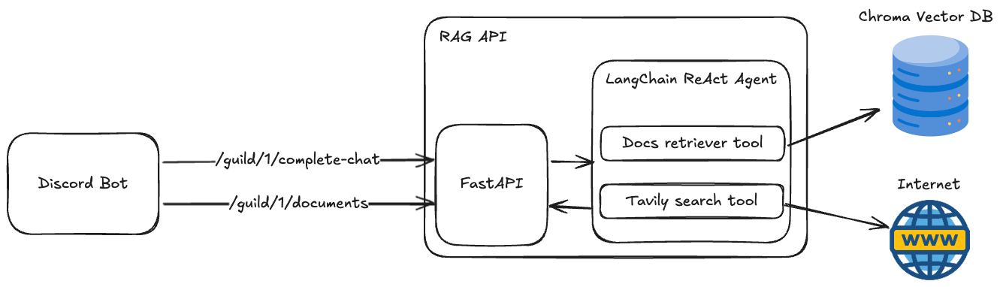

# rag-bot

## Repositories

- [bot](https://github.com/seg-org/rag-bot)
- [api](https://github.com/seg-org/rag-api)

Making a bot that can **leverage documents** with **RAG** to generate relevant responses.

## Design



### Discord Bot

- /add-text: Adds text to the vector database knowledge base.
- /add-web: Adds web page (you input the url, the API will load data from that page) to the vector database knowledge base.
- /toggle-web-search: Toggles whether the bot should search the web for data when it can't find any in the vector database.

Note: the requests the bot makes to the API have guild IDs in the url params in order to keep track of the loaded documents for each guild **separately**.

### FastAPI

acts as an interface between the Discord bot and the Langchain ReAct Agent

### LangChain ReAct Agent

To be precise, ReAct Agents are from LangGraph library, which is a part of LangChain. ReAct Agents find answers to queries using the tools we provided: Docs retriever tool and Tavily search tool.

- Docs retriever tool: This tool retrieves documents from the vector database that are relevant to the query.
- Tavily search tool: This tool searches the internet for relevant data when the Docs retriever tool can't find any relevant data in the vector database.

## Stack

- discordjs

## Getting Started

### Prerequisites

- 💻
- bun
- node 20
- [discord bot](https://discordjs.guide/preparations/setting-up-a-bot-application.html#creating-your-bot)

### Installation

1. Clone this repo
2. Copy `.env.template` and paste it in the same directory as `.env` and fill in the values.

```bash
NODE_ENV=development
API_URL=
API_KEY=

BOT_TOKEN=
BOT_CLIENT_ID=
```

3. Download dependencies by `bun i`

### Setting up your discord bot

1. Go to the [discord developer portal](https://discord.com/developers/applications).
2. Create a new application

- In `Bot` tab, click `Reset Token` to get your bot's access token, it is the `BOT_TOKEN` field in `.env`.
- In `General Information` tab, the `Application ID` is the `BOT_CLIENT_ID` field in `.env`.

3. To add the bot to your server, go to `OAuth2` tab, check `bot` in `scopes` and `Administrator` (or less permissions as see fit) in `bot permissions`, then copy the link and paste it in a new tab on your browser.
4. For `OPENAI_TOKEN`, go to the [openai dashboard](https://platform.openai.com/account/api-keys) and create a new API key, you need to top-up some $$ first.

### Running

1. For the first time or every time you add new commands, run `bun deploy-commands` to deploy the commands to the discord server.
2. Run `docker-compose up -d` to start vector database.
3. Run `bun dev` to start local bot.
